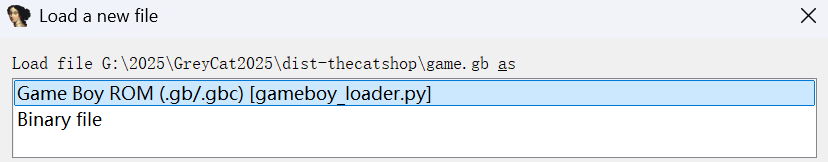

# IDA-GameBoy-Loader
Using IDA's Zilog Z80 processor module to disassemble GameBoy games. The reason for calling it experimental is that there may be some errors, since SM83 is a fusion of the Zilog Z80 and the Intel 8080, and does not have either the IX and IY registers of the Z80 or the IN and OUT instructions of the 8080, and adds a few new instructions that don't exist in the Z80 and 8080.

This loader is written for IDA 9.0 and may not be compatible with older versions.

## How to use?

Just put gameboy_loader.py into the /loaders folder in your IDA root directory.

## TODO

- [ ] Improve function identification and naming
- [ ] Graphics Data (Tiles, Sprites)
- [ ] Support for native Game Boy CPU (SM83) instruction set
- [ ] Fix bugs in recognizing functions and data segments
- [ ] (Almost impossible) support for IDA decompiler to output C pseudo-code

## References

Thanks to [LIJI32/gameboy.py](https://gist.github.com/LIJI32/3cf3d2b55461ab8e38ca8e3dc0a6464f)

